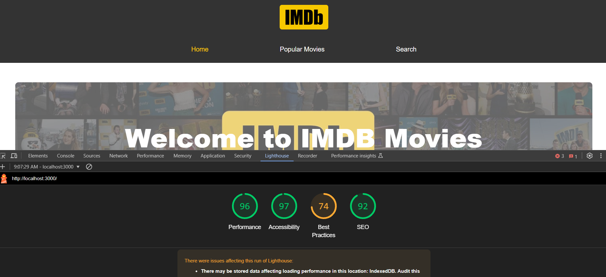

# IMDB Movie App with React

A wweb application to browse popular movies, search for movies, and view movie details. The app uses Reactjs for the frontend and Redux for state management.

## Features

- Show a list popular movies in 2024.
- Provides a search bar to find movies based on parameters.
- Provide detailed information about the movie.
- Display various movies in home page and hero sections
- Maximalize performance website and do SEO testing using Lighthouse
  

## Tech Used

- Reactjs : as main library.
- Redux : for state management.
- React-router : for routing pages.
- CSS : for styling and layout.
- API IMDB : for fetch movies data

### How To Run Locally

1. **Clone the repository:**
    ```bash
    git clone <repository-url>
    cd project-name
    ```

2. **Install dependencies:**
    ```bash
    npm install
    ```

3. **Start the development server:**
    ```bash
    npm start
    ```
